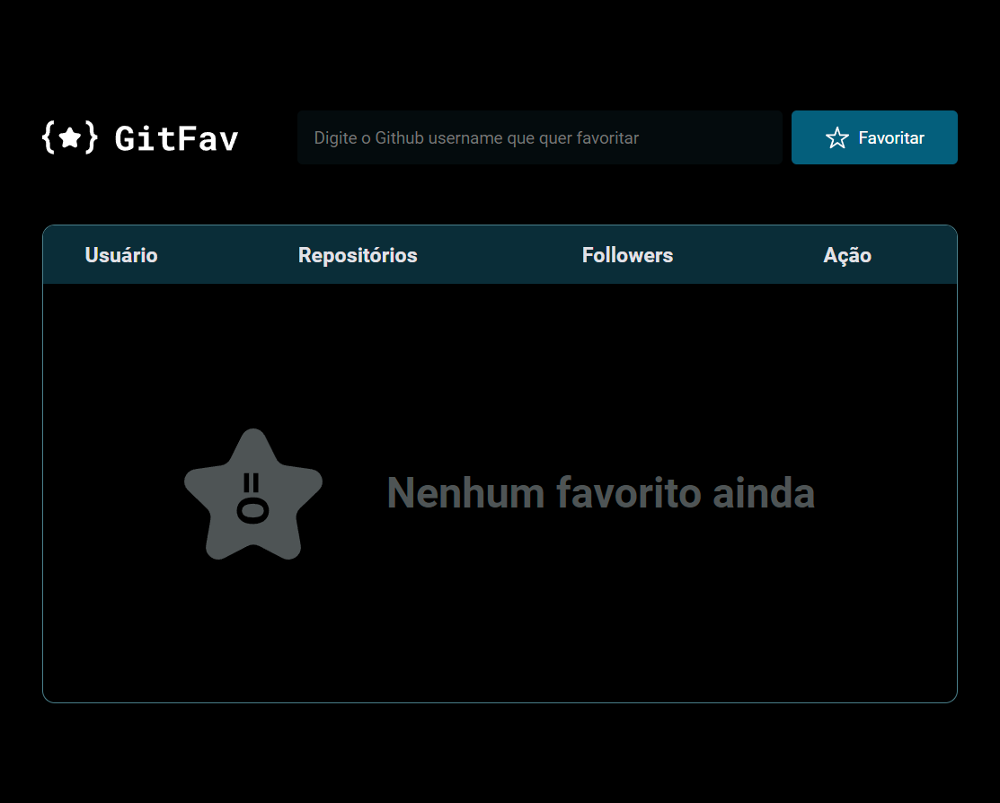
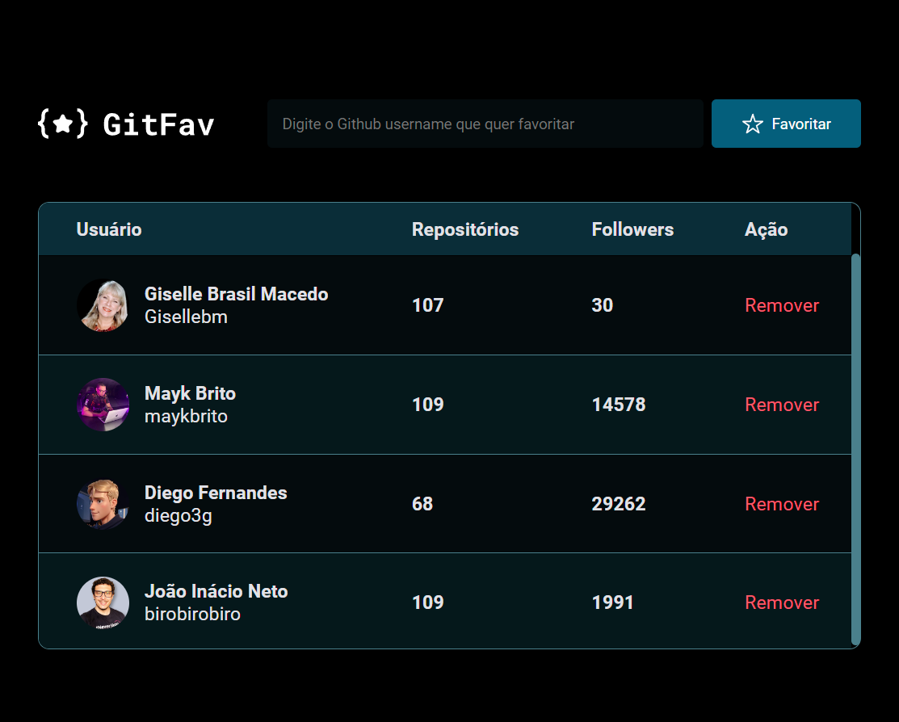

# GIT FAV

### Projeto Desenvolvido como Desafio do Stage 06 / Módulo 02 do Curso Explorer da Rocketseat.

 

  
  

> Trilha Explorer

 

 

## 💻 Projeto

Aplicativo para favoritar repositórios do Github.

 

## 🚀 Recursos Utilizados

- Tabelas no HTML;
- Construção e estilização de dark/light model;
- Variáveis CSS;
- Utilização  da função clamp() do CSS, para ajustar automaticamente o tamanho da fonte de acordo com a largura da tela;
- Estilização da barra de rolagem utilizando ::-webkit-scrollbar
- Utilização do Event.preventDefault();
- Utilização do método filter();
- Utilização de API do Github;
- Acessibilidade - sr-only(Screen Reader Only);
- Classes e herança no JS;
- Desestruturação no JS;
- Criando HTML com JS;
- Alterar CSS no JS;
- Métodos estáticos e promessas;
- Promessas com Async e Await;
- localStorage;
- Cuidando do fluxo da aplicação com try, catch e throw;
- Utilização da API fetch;
- Versão mobile.
   

## 🚀 Tecnologias

Esse projeto foi desenvolvido com as seguintes tecnologias:

- HTML
- CSS
- Javascript
- Git e Github
 

## 💻 Deploy 
- https://gisellebm.github.io/Desafio_GitFav/

 

## Contato: gisellemacedo.dev@gmail.com

 

<h3 align="center">Feito com 💜 by Giselle</h3>

-------------------------------------------------------------------------------------------------------

# GIT FAV

### Project Developed as a Challenge for Stage 06 / Module 02 of the Rocketseat Explorer Course.

 

  
  

> Explorer Trail

 

 

## 💻 Project

Application to favorite Github repositories.

 

## 🚀 Resources Used

- Tables in HTML;
- Construction and styling of dark/light model;
- CSS variables;
- Use of the CSS clamp() function to automatically adjust the font size according to the screen width;
- Styling the scrollbar using ::-webkit-scrollbar
- Use of Event.preventDefault();
- Use of the filter() method;
- Use of Github API;
- Accessibility - sr-only(Screen Reader Only);
- Classes and inheritance in JS;
- Destructuring in JS;
- Creating HTML with JS;
- Change CSS in JS;
- Static methods and promises;
- Promises with Async and Await;
- localStorage;
- Taking care of the application flow with try, catch and throw;
- Use of the fetch API;
- Mobile version.
   

## 🚀 Technologies

This project was developed with the following technologies:

- HTML
- CSS
- Javascript
- Git e Github
 

## 💻 Deploy 
- https://gisellebm.github.io/Desafio_GitFav/

 

## Contact: gisellemacedo.dev@gmail.com

 

<h3 align="center">Made with 💜 by Giselle</h3>

